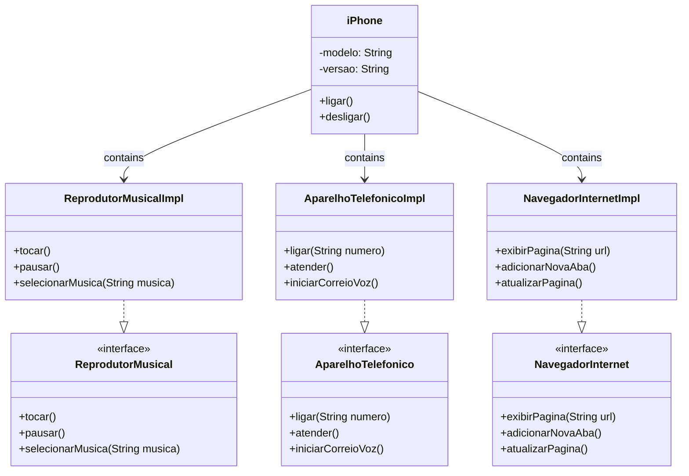

### Implementation of the DIO UML challenge

## Reference Project
[Digital Innovation One (Desafios POO)](https://github.com/digitalinnovationone/trilha-java-basico/tree/main/desafios/poo)

## UML Class Diagram

